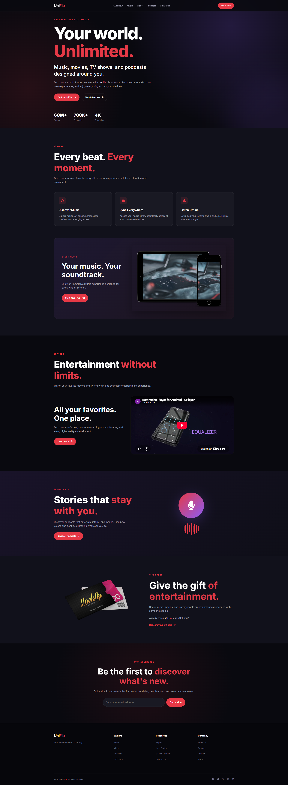

# UniFlix 🎬

UniFlix is a responsive entertainment landing page for music, movies, podcasts, and digital entertainment. It features a modern dark-themed interface with responsive navigation and sections designed for different entertainment services.


## 🛠️ Tech Stack

* HTML5
* CSS3
* JavaScript
* Font Awesome

---

## 📸 Preview

[](https://gbgabiola.github.io/uniflix)

Visit the [Live Preview](https://gbgabiola.github.io/uniflix)

## 🚀 Getting Started

To explore, run, or debug the project locally on your machine:

1. **Clone this workspace:**
   ```sh
   git clone https://github.com/gbgabiola/uniflix.git
   ```
2. **Change into the repository directory:**
   ```sh
   cd uniflix
   ```
3. **Run a local server:**<br />
   Open the root workspace using VS Code and launch the **Live Server** extension, or open individual `index.html` files directly inside your preferred web browser.

---

## 🤝 Contributing

Contributions and suggestions are welcome.

### Report an Issue

If you find a bug or have an idea for improvement, open an issue in the project's GitHub repository:

[Open an Issue](https://github.com/gbgabiola/uniflix/issues/new)

When reporting an issue, please include:

* A short description of the problem
* Steps to reproduce it
* Expected behavior
* Actual behavior
* Screenshots, when applicable

### Suggest an Improvement

For larger changes, feel free to open an issue first to discuss the proposed improvement before submitting a pull request.

You can also reach out to me directly through LinkedIn:

[Connect with me on LinkedIn](https://www.linkedin.com/in/gbgabiola)

---

## 💬 Let's Connect

If you want to talk shop about software engineering or collaboration opportunities, feel free to drop by:

* [Portfolio](https://bit.ly/gbgabiola)
* [LinkedIn](https://www.linkedin.com/in/gbgabiola)
* [X (Twitter)](http://x.com/gbgabiola)

---

&copy; 2026 gbgabiola • This repository is completely open-source and free to adapt under the terms of the [MIT License](LICENSE).
